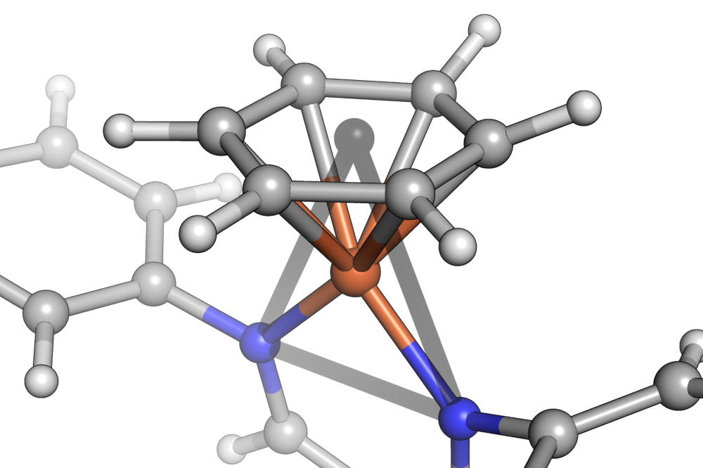
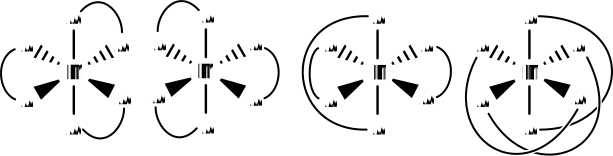

Molecule model
==============

This section aims to be a fast introduction to the concepts necessary to get
productive with this library.

Parts
-----

:class:`~scine_molassembler.Molecule` instances are composed of a
:class:`~scine_molassembler.Graph` and a
:class:`~scine_molassembler.StereopermutatorList`. The
:class:`~scine_molassembler.Graph` represents
atoms as vertices and bonds as edges in a mathematical graph. The
:class:`~scine_molassembler.StereopermutatorList` contains objects to handle the
relative spatial arrangements of atoms.
:class:`~scine_molassembler.AtomStereopermutator` instances are responsible for
classifying the local :class:`~scine_molassembler.shapes.Shape` of its
substituents and allowing permutation through distinct non-rotationally
superimposable arrangements of its substituents. One of the simpler stereogenic
cases it manages is that of an asymmetric tetrahedron, where its two
stereopermutations represent the *R* and *S* arrangements. The
:class:`~scine_molassembler.AtomStereopermutator` manages these arrangements in
distinct shapes that range from two substituents (linear and bent) up to twelve
(icosahedron and cuboctahedron).
:class:`~scine_molassembler.BondStereopermutator` instances are responsible for
the relative arrangement of two
:class:`~scine_molassembler.AtomStereopermutator` instances fused at arbitrary
vertices of their shapes. They manage, for instance, the E and Z arrangements at
asymmetric double bonds.

Shapes
------

Molassembler classifies the substituents around every non-terminal atom into a
polyhedral :class:`~scine_molassembler.shapes.Shape` if a
:class:`~scine_molassembler.Molecule` is constructed with Cartesian coordinates.

.. figure:: images/molecule_shapes.png

   Octahedron, tetrahedron and equilateral triangle shapes shown in a sample
   molecule.

In order to deal with haptic ligands, a further abstraction is introduced:
Substituents are always grouped into binding sites made of contiguous sets of
atoms. Then that set of atom's centroid is taken as a putative shape vertex
position in shape classification.

   The centroid of the benzene in is shown as a gray sphere in the center of the
   carbocycle. The shape of the iron center is then closest to an equilateral
   triangle.

Alternatively, when molecules are constructed by a
:class:`~scine_molassembler.Graph` only, shape classification from positions is
replaced by a shape inference algorithm that tries to guess reasonable shapes
based only on graph information (which is limited in accuracy, generously
speaking, as soon as inorganic centers are involved).

Stereopermutations and feasibility
----------------------------------

Now we need to figure out how many different non-superposable relative
arrangements of the binding sites are possible within the classified shape. The
operative word being *different*, the binding sites of each non-terminal atom
are ranked according to extended IUPAC sequence rules. The ranking and links
between sites are reduced to an abstract binding case such as
(A-A) :subscript:`3`. From there, we enumerate the following non-superimposable
cases within a particular shape, say, an octahedron:

   In an octahedron, the abstract binding case (A-A) :subscript:`3` has four
   distinct non-superimposable arrangements, termed stereopermutations. In the
   first two, all bidentate ligands are arranged cis (i.e. the angle between
   the shape vertices they occupy is :math:`\frac{\pi}{2}`). These are the
   :math:`\Lambda` and :math:`\Delta` enantiomers, commonly likened to
   ship-screws wound in different rotational directions. The third is
   cis-cis-trans, and the last trans-trans-trans.

Whether any of these stereopermutations are actually possible in a particular
molecule depends on the length of the bridge between the binding atoms of the
bidentate ligand. If it's very long, then perhaps all stereopermutations are
possible. At intermediate lengths, the stereopermutations with
trans-arrangements might be infeasible, and at very short bridge lengths (say,
just one intermediate atom), none of them might be possible.

Molassembler takes the abstract enumerated stereopermutations and checks the
feasibility of all bridges between any multidentate ligands, if present.
Additionally, if there are haptic ligands, the cone it occupies is estimated and
collisions between haptic ligands are avoided.

Atom stereopermutators
----------------------

In a :class:`~scine_molassembler.Molecule`,
:class:`atom stereopermutators <scine_molassembler.AtomStereopermutator>` are
instantiated on each non-terminal atom. Atom stereopermutators store the local
shape at this atom, all abstract stereopermutations (with relative statistical
occurrence weights), the results of the feasibility checks, and which
stereopermutation is currently realized. Note that terminal atoms aren't
particularly interesting because their local shape has merely a single vertex
and there isn't much to manage. The stereopermutation an
:class:`~scine_molassembler.AtomStereopermutator` is set as can only be
determined if Cartesian coordinates are present. Otherwise, if there are
multiple feasible stereopermutations but no way to determine which is realized,
the :class:`~scine_molassembler.AtomStereopermutator` is *unspecified*. This
means that it represents all of its feasible stereopermutations. The
conformational ensemble of a molecule with a single
:class:`~scine_molassembler.AtomStereopermutator` representing an unspecified
asymmetric tetrahedron (where there are two possible stereopermutations, known
by their stereodescriptors *R* and *S*), is essentially a racemic mixture.

Molassembler introduces a particular terminology here. Stereopermutators expose
two different stereodescriptors. The first, the *index of permutation*, 
independent of any feasibility checks, is just a number ranging from zero to
the number of stereopermutations minus one. From our example in an octahedron
shape from before, there are four stereopermutations. The valid indices of
permutation are then zero, one, two and three. Say within the particular
:class:`~scine_molassembler.Molecule`, only the all-cis arranged
stereopermutations are feasible. The set of feasible stereopermutations is
indexed just like the set of all stereopermutations, and that index is
called an *assignment*, because these are the only stereopermutations that you
can assign a stereopermutator to. Assignments, like indices of permutations, are
merely a number ranging from zero to the number of feasible stereopermutations
minus one. In our octahedron example, there are two feasible stereopermutations,
and valid assignments are zero and one.

Bond stereopermutators
----------------------

Stereogenic arrangements of atoms due to rotational barriers around bonds are
managed by :class:`bond stereopermutators
<scine_molassembler.BondStereopermutator>`. They can be formed with arbitrary
assigned, adjacent :class:`atom stereopermutators
<scine_molassembler.AtomStereopermutator>`. Like their atom-centric
counterparts, a feasibility algorithm determines whether particular rotational
arrangements are possible given any bridges connecting its ends. As a result, in
carbocycles of sizes three to seven, bond stereopermutators composed of
equatorial triangles, bent shapes or mixtures thereof are not stereogenic,
i.e. only a single stereopermutation is feasible.

Keep in mind that bond stereopermutators are by no means connected with any sort
of molecular orbital reasoning, and are purely phenomenological. Given a
:class:`~scine_molassembler.Molecule` with any sort of flat cycle in its
Cartesian coordinates, molassembler will instantiate :class:`bond
stereopermutators <scine_molassembler.BondStereopermutator>` on *all* edges of
the cycle. Similarly, molassembler will not complain if a bond stereopermutator
is instantiated on a bond of single bond order.
