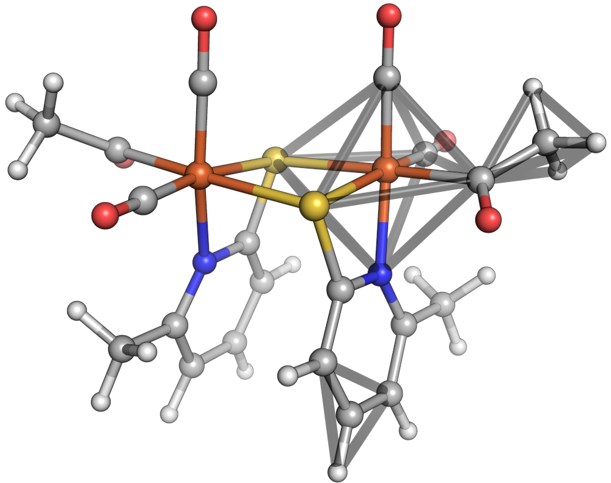

Molecule model
==============

Parts
-----

:class:`scine_molassembler.Molecule` instances are composed of a
:class:`scine_molassembler.Graph` and a
:class:`scine_molassembler.StereopermutatorList`. The
:class:`scine_molassembler.Graph` represents atoms as vertices and bonds as
edges in a mathematical graph. The
:class:`scine_molassembler.StereopermutatorList` contains objects to handle the
relative spatial arrangements of atoms.
:class:`scine_molassembler.AtomStereopermutator` instances are responsible for
classifying the local shape of its substituents and allowing permutation through
distinct non-rotationally superimposable arrangements of its substituents. One
of the simpler stereogenic cases it manages is that of an asymmetric
tetrahedron, where its two stereopermutations represent the R and S
arrangements. The :class:`scine_molassembler.AtomStereopermutator` manages these
arrangements in distinct shapes that range from two substituents (linear and
bent) up to twelve (icosahedron and cuboctahedron).
:class:`scine_molassembler.BondStereopermutator` instances are responsible for
the relative arrangement of two :class:`scine_molassembler.AtomStereopermutator`
instances fused at arbitrary vertices of their shapes. They manage, for
instance, the E and Z arrangements at asymmetric double bonds.

Construction steps
------------------

When Molecules are constructed with a graph and Cartesian coordinates, the
following individual steps occur: At each non-terminal atom, substituents are
grouped into sites, where sites constituted by multiple substituents are haptic.
These sites are then ranked according to extended IUPAC sequence rules. Then,
the spatial arrangement is classified into a distinct shape.

   Octahedron, tetrahedron and equilateral triangle shapes shown in a sample
   molecule.

   When it comes to haptic ligands, the set of haptically bonded atoms' centroid
   is taken as a putative vertex position.

.. figure:: images/haptic_shape.png

   The centroid of the benzene in is shown as a gray sphere in the center of the
   carbocycle. The shape of the iron center is then closest to an equilateral
   triangle.

Alternatively, when molecules are constructed by a graph only, this part of the
construction is replaced by a shape inference algorithm that tries to guess
reasonable shapes based only on graph information (which never contains charge
information, and is hence limited in its usefulness).
