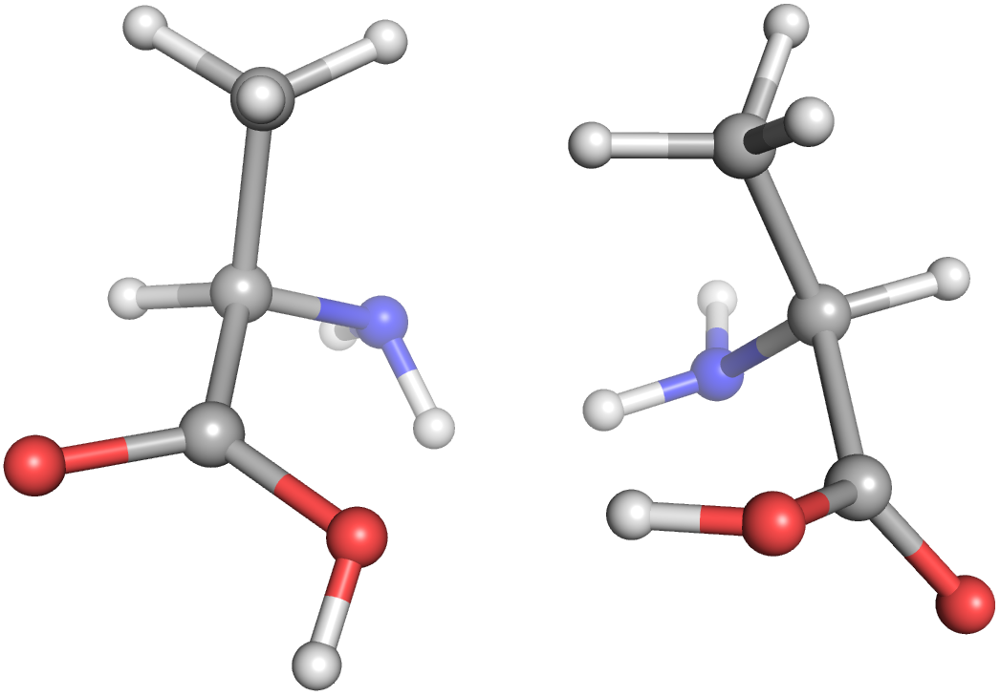

Recipes
=======

Now that we are familiar with the concepts of the molecular model, let us dive
into some examples.

.. note::

   Molassembler ships with an experimental SMILES parser that, pending some
   bugfixes and some more implementation details, should achieve full openSMILES
   standard-compliacne and be stabilized in a future release.

   It's not yet part of the public API, but it can already do a lot, which is
   why you'll see it in some of these examples.

Alanine enantiomers
-------------------

Let's get right into a :class:`~scine_molassembler.Molecule` example with
multiple stereopermutations. Here, we're creating an alanine
:class:`~scine_molassembler.Molecule` from a SMILES string, creating its
enantiomer, generating a conformation for each molecule, and writing those to
separate files.

>>> alanine = io.experimental.from_smiles("C[C@@H](C(=O)O)N")
>>> has_multiple_stereopermutations = lambda p: p.num_stereopermutations > 1
>>> interesting_stereopermutators = list(filter(
        has_multiple_stereopermutations,
        alanine.stereopermutators.atom_stereopermutators()
    ))
>>> assert len(interesting_stereopermutators) == 1
>>> stereopermutator = interesting_stereopermutators[0]
>>> stereopermutator.num_stereopermutations
2
>>> # Figure out which is the 'other' stereopermutation
>>> other = 0 if stereopermutator.assigned == 1 else 1
>>> # Make a conformation of alanine and its enantiomer and write each to a file
>>> from copy import copy
>>> alanine_enantiomer = copy(alanine)
>>> alanine_enantiomer.assign_stereopermutator(stereopermutator.central_index, other)
>>> def write_conformer(mol, filename):
        result = dg.generate_random_conformation(mol)
        assert not isinstance(result, str)
        io.write(filename, mol, result)
>>> write_conformer(alanine, "alanine.mol")
>>> write_conformer(alanine_enantiomer, "alanine_enantiomer.mol")

   The two alanine enantiomers side-by-side generated by the previous script.

Ship-screw enantiomers
----------------------

Let's move on to a multidentate complex in which feasibility is relevant. We'll
consider the octahedral iron oxalate complex:

>>> shipscrew_smiles = "[Fe@OH1+3]123(OC(=O)C(=O)O1)(OC(=O)C(=O)O2)OC(=O)C(=O)O3"
>>> shipscrew = io.experimental.from_smiles(shipscrew_smiles)
>>> permutator = shipscrew.stereopermutators.option(0)
>>> assert permutator is not None
>>> permutator.num_stereopermutations # Number of abstract permutations
4
>>> permutator.num_assignments # Number of spatially feasible permutations
2
>>> permutator.index_of_permutation
2
>>> permutator.assigned
1
>>> for i in [0, 1]:
        shipscrew.assign_stereopermutator(0, i)
        result = dg.generate_random_conformation(shipscrew)
        assert not isinstance(result, str)
        io.write("shipscrew-" + str(i) + ".mol", shipscrew, result)
